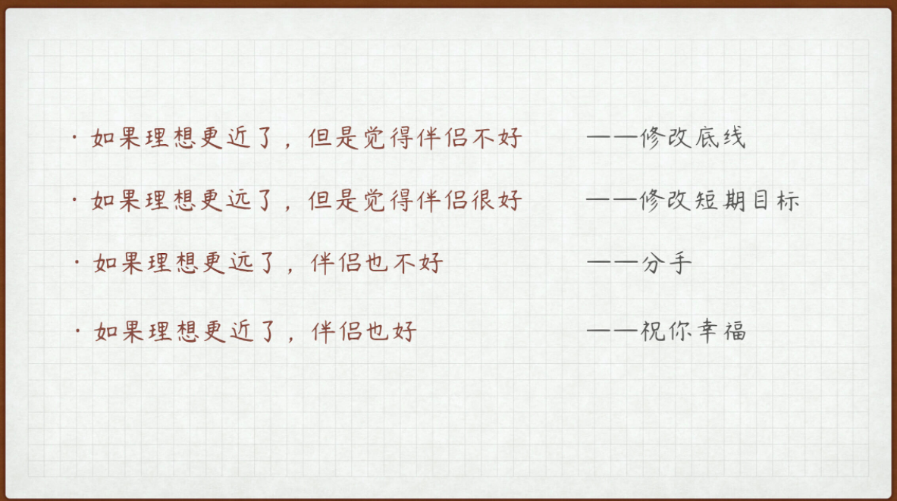
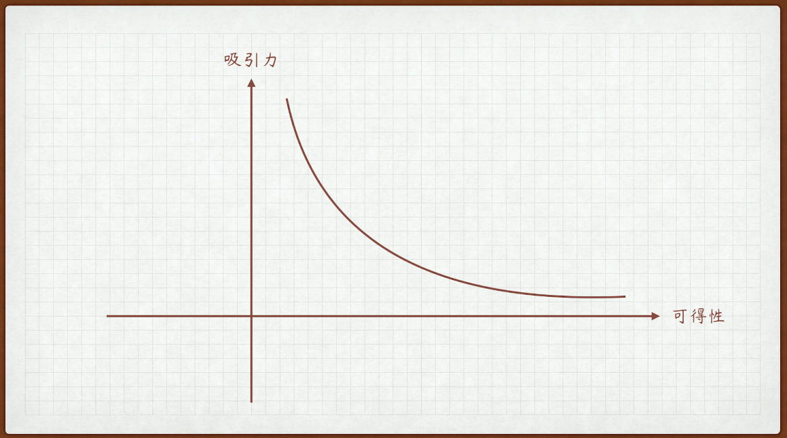
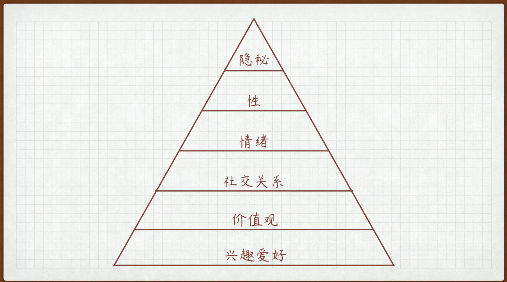

# 1.恋爱目标

**三条恋爱目标的原则**

第一条：再差的目标，也胜过没有目标。

第二条：再好的目标，也得服从人生目标

爱情就是一场自我修炼，找对象其实也是在找寻自我。

第三条：恋爱目标，要以我为主

良性的恋爱是会让两个人都变好的，当你把目标从取悦他人转到取悦自己上来，你会发现恋爱将变得前所未有的简单，也前所未有的充满意义。

## 1.1如何找到自己的恋爱目标

Step1：在任意一个空闲的晚上，在一张纸上列出下面的内容：

你希望在一段感情中得到什么？

你绝对不能妥协牺牲的底线是什么？

这两点，每一点分别写五条，然后再划掉两条，这是一个不断权衡的过程。

Step2：在纸的另一侧，列出你人生的理想和中期、短期规划目标。

Step3：当你进入一段感情后（包括在追求期），每隔一段时间，你就拿出这个恋爱目标单进行迭代。如果你处于一段感情很久了，你也可以用这个方法，写下这段感情的目标。

当你觉得距离人生理想更接近了，就修改底线；

当你觉得距离人生理想更遥远了，就修改目标；

当你觉得这段感情偏离四个以上的恋爱目标，就认真考虑脱离这段感情。

示意图

这个方法也许不会帮你确定一个完美的目标，但是一定会让你在这个过程中，有所收获。有的时候，在情感问题上，万有引力那个公式不重要，那个砸中牛顿的苹果才重要。

“贵以身为天下，若可寄天下，爱以身为天下，若可托天下”。以我为主，不仅是恋爱的智慧，更是人生的智慧。

# 2.**拒绝焦虑状态：TA到底爱我吗**

第一，你对这个人有好感；

第二，你对这个人没把握；

第三，你希望找到一些依据给自己勇气，来支撑自己继续坚持。

破局之道的第一要点就是，你要先改变自己这个状态，千万不要因为对方可能喜欢你，你才去喜欢人家，你最需要做的不是焦虑对方是否喜欢你，而是要确定自己是否喜欢对方。确定了这一点之后，我们才可以进入下一个环节。

**你是主动派 or 被动派**

1.如果你选被动等待。

你要拥有一种勇气，一种哪怕到了最后对方不喜欢自己，但你做过的事情仍然是你愿意做、喜欢做的事情的勇气。

选择被动等待的策略并不意味着始终等待对方先行动，适时主动出击不但不会让你受制于人，而且能够让你更加享受这段关系。

当你**选择被动策略时**，意味着你的**目标对象承担了更多的责任和压力**，一点点的主动，也会让 Ta 感受到莫大的安慰。在恋爱中，永远要做个善良的人，这比恋爱更加重要。

2.如果你选择主动出击

吸引力法则：吸引力不仅取决于价值，也取决于可得性。

我们都知道，价值越高的人吸引力越大，但是比如说，对于一个男生来说，如果范冰冰和隔壁颜值很高的同事小姐姐，同时放在他面前，让他选择，他大概率会选后者，因为前者对于他来说，可得性太低。

我给被动等待的人的建议是，别太被动；我给主动出击的人的建议是，别太主动。这看似朴实无华的道理，蕴藏了深意，总结就是：**既不刻意讨好，也不掩饰喜欢**。

主动和被动从来都没有明确的界限，两个人的关系应该像弹簧，**Ta 强你就弱，Ta 弱你就强**，和谐的起点就是让爱情的小树苗在相互试探、相互追逐中茁壮生长。

**爱情是从“我”入手**

要记住，找一个人谈恋爱绝不是因为这个人在暗暗喜欢你，而必须是因为你足够喜欢这个人。因为足够喜欢，所以勇敢，这种勇敢不是直勾勾地表白，也不是惨兮兮地跪舔，而是坚持自我、展现自我、享受自我的过程。

即使看牌的机会有很多，但真心喜欢的人错过一个就少一个，偶尔也勇敢点，该 all in 就大胆上。毕竟，有时候，感情不是稳扎稳打的将就，而是一往无前的梭哈。

**总结**

如果你选择被动等待，那么我想告诉你，主动出击并不会受制于人；如果你选择主动出击，那么你要记住吸引力不仅取决于价值，也取决于可得性，可以主动，但要有节奏的变化。

最后，我想说，爱情的牌怎么打，不单单取决于对方的底牌，更重要的是自己有哪些牌。如果你**确定自己足够喜欢足够爱**，拿着 4 条 A 就该勇敢甩出啊。

# 3.**冒犯有时是必要的：如何开启一段亲密关系**

**从关系维度入手**

**前期：务必真诚**

就是说，不要掩饰什么，也不要立什么人设，就是说自己是什么样的人展示给她的感觉就是什么样的人。

就是说让人感觉你目的性很强，做一件事背后的目的与实际的展示的目的不一样，让人感觉你在欺骗别人。

有人问过我，真诚会不会显得很傻。我说，嗯，有时候是会有点傻，但是只要你在爱情中，感情是真挚的，不管有多热烈，不管看上去有多傻，都会赢得人的尊重，否则就会引起人的厌恶。

**中期：敢于冒犯**

在靠谱的基础上，双方更看重的是对方带来的情绪和体验。

所以，**冒犯——回报的循环**，就是**两人升级关系的过程**，阿朱和乔峰就是在这样的多个轮次中，不断加深关系，最终许下塞上牛羊之约，确定了关系。

关于如何正确地“冒犯”，我有三点告诉你：

一来要**讲究善意**，我问你要电话，是为了能跟你联系，不是转手给人卖掉信息；

二来要**讲究分寸**，不要越级突破，明明是点头之交，跑人家楼下唱歌摆鲜花求人家做自己女朋友就是过于急躁了；

三来要**讲究平衡**，今天麻烦你帮我取了快递，明天给你带一份水果。

两个人要建立亲密关系，就不能总是客客气气按照社交礼仪，时刻注重保持双方的合适距离，把界限分得很清楚，**必须有人率先打破现有关系水平，提出一些略有“冒犯性”的要求。**

当然，敢于冒犯不是粗鲁猥琐，冒犯并不是让你把人按在墙上壁咚，也不是打着心直口快的幌子说黄段子，而是**敢于示弱，告诉别人，你需要帮助**。**示弱**是**开启亲密关系的精髓所在**，强而示之弱，能而示之不能，这既代表了你的态度，也显示了你的能力，更为对方提供了价值需求。

**后期：及时止损**

建立亲密关系的本质过程，就是两个人互相冒犯，侵入到一方觉得受不了，就散了；又或者侵入到足够近，双方还能接受，那就瓜熟蒂落，水到渠成。

那么当对方有哪些表现，你就应当立刻抽身离开呢？不算其人本身人品、性格的缺陷，我认为有以下几种情况，你就可以考虑马上止损了。

**明确拒绝或暗示你，你俩不可能**。（说到这得补一句，人家说现在不想谈恋爱的意思不是现在不谈，是不想跟你谈，要听懂拒绝。）

**有意或无意让你知道，她有对象 / 喜欢的人**，无论这个人是不是真实存在的。

**从来不主动，爱答不理**，有你也行没你也行，对你不感兴趣，不愿意主动了解你的生活。

**只索取不付出的**，包括但不限于金钱、情感、时间、精力等等。

**总结**

首先是前期，务必要真诚，真诚足以打动适合你的人；然后，到了中期，要敢于冒犯，你要起个头表达好感，敢于打破社交距离冒犯一个人，既是示好的方式，也是提供进一步接触的机会。

但是冒犯要注意，一要善意，二要谨防越级，三要记得找补。冒犯的最高级是示弱。

要记住，不要玩套路。开启亲密关系，是两个人互相了解、互相试探、逐步加码的过程，正确的办法不能搞定错误的人，但错误的办法可以搞砸正确人。

# 4.**亲密关系的本质是分享：如何把握暧昧的窗口期？**

在这个窗口期，双方既建立了初步的信任，又还保留着神秘的面纱，相互之间吸引力、安全感都处于最佳状态。我们管这个窗口期就叫作暧昧期，把握住这个时期，升级关系会事半功倍。

**怎样判断自己处于暧昧窗口期？**

暧昧的核心感觉是不确定性，既对对方的心意不确定，也对自己的心意不确定，正是这种不确定加强了这段关系的吸引力。

如果说恋爱像是发工资，暧昧就像是赌博，同样是收钱，但心态和感觉完全不同。

根据暧昧的这种特点和性质，我总结了以下进入暧昧期和退出暧昧期的几个标志。

**进入暧昧期的三个显著标志**

第一是特别感。

特别感就是一种独有的吸引力，大千世界、芸芸众生，唯有在你身上见到这种别样的特质，这当然是一种好感。同时表达特别感又很安全，朋友之间、对手之间、恋人之间都可以有特别感。

一旦有异性**表示，你在任何一个方面有 Ta 从未遇到过的特别之处**，哪怕是一个很奇怪的特别，都说明你俩关系可能已经进入暧昧期。

第二是细节感。

**如果说特别感是一种吸引力，那么细节感就是一种注意力**。

**特别感是因，细节感是果**，在这个注意力极其珍贵的移动互联网时代，能够在你身上投入相当程度的细节记忆力，已经充分说明了你的重要性。但同时，**表达细节感的时候又带有一点犹豫**。也就是注意力，一个人对你的注意力够多，你说是不是对你有意思。

毕竟，**一个细心的人、体贴的人对谁都可以满满细节感，也不能实锤就是喜欢吧**。所以，如果出现了这种欲说还休的感觉，把细节感的张力拉满，这就是一种暧昧的小表现。

第三是抗拒感。

所谓暧昧，一定是两个人互有**一定好感的同时，还有一定防备**。这种抗拒感可能因为抗拒确立双方关系，也可能是抗拒关系太快发展、抗拒肢体接触、抗拒主动表白、抗拒在朋友前暴露对方存在等等……

偶尔表达对方的特别感，“哇，你是我遇见过的姑娘里面，第一个会自己动手装家具的耶。”

在不经意间表露自己的细节感，“哈哈，你上个月有一次听这首歌的时候循环了好几遍，我就猜你喜欢这首歌~”

在安全范围内，制造一点点抗拒感，“今天聊得很开心，明天还要上班，早点休息吧。”

**退出暧昧期的三个显著标志**

第一，抗拒感逐步消失。

抗拒感逐步消失的更大一种可能就是，你的异性吸引力在逐步消退。是你在对方眼里的异性攻击力不断消退，显得越来越安全，所以人家不拒绝和你进一步深入接触。

第二，开始公然损你。

**真朋友**可能会在**别人面前损你，抖你的糗事**；但**喜欢你的人**，私下里或许也会挖苦你几句，但在有**其他人在场的情况下**，Ta 绝对会小心翼翼地**避过所有可能让你没面子的事情**。所以，当对方开始频频当着其他人的面，毫不顾忌开玩笑嘲讽你的时候，你们的暧昧期就即将到头了。

第三，规律性逐渐增强。

暧昧的核心在于不确定性，而这种心理感觉消失的表现就是一切可预测。

良性暧昧关系和恶性暧昧关系的区别主要有三点：

一是良性暧昧的感觉是双方，恶性暧昧的感觉是单向的；

二是良性暧昧关系可互动可升级，恶性暧昧关系始终无法升级；

三是良性暧昧关系的发起方抗拒感较弱，恶性暧昧关系的发起方反而抗拒感较强。

最后，恶性暧昧关系的时间一般长于良性暧昧。

**窗口期最重要的任务**

暧昧窗口期最重要的任务，就是借助这段时间特有的吸引力，迅速升级双方关系。那么问题来了，亲密关系或者说恋爱关系的本质是什么？什么叫升级关系？

恋爱关系的核心在于信息交互！

信息交互的层级决定了两个人关系的远近，交互层级越浅，可交互人数就越多，关系就越疏离；交互层级越深，可交互人数也就越少，关系也就越亲密。

我粗略地将信息交互的层级分为六层：

\1. 兴趣爱好

这是非常开放的信息，也是作为朋友的起步层级。

如果两个人之间愿意交流兴趣爱好，在一起打牌、玩游戏、看话剧等等，并就这些爱好展开聊天互动，就可以成为朋友。这个层级人数最多，也是你和异性之间互动的起点。

\2. 价值观

这个信息相对私密，起码要进入密友的程度，才会围绕这个主题展开信息交换。

你很难想象两个相识不久，只是在一起作为牌搭子的人会在一起谈人生、谈理想、谈未来，那是很尬的。能谈这些的，一定得是非常好的朋友。当你和某个异性进入这个话题，说明你们之间关系已经开始不一般，有一些感觉了。

\3. 社交关系

每个人都有自己的核心社交圈，当你向某个人开放自己核心社交圈的时候，这个人显然已经是你极其亲近的人。当你和异性能够频频地、又自然地出现在对方核心社交圈内，无论互相怎么介绍，在旁人看来，你们之间肯定有点什么了。

\4. 情绪

成年人的世界没有容易二字，崩溃都需要找个合适的时间。分享情绪信息给他人是一件非常危险的事情，一般也只有家人会无条件接受你的情绪输出。所以说，当你能够和一名异性在任意时间分享情绪信息的时候，你们可以说已经实质上建立了情侣关系。

\5. 性

滚床单不等同于性层面的交互，其实握个手、抱一抱都算作这方面信息的交互，当然了，滚床单也可能完全不涉及这个层级的互动。语言、肢体甚至眼神都可以是这个层级交互的媒介，而这也是可能恋爱甚至结婚多年都达不到的交互层级。

\6. 隐秘

人心里都有一个隐秘的角落，藏着自己不为人知的秘密、不堪回首的事情，这是一个人最软弱的要害。当你可以放心和一个人互相分享这个隐秘的角落时，你们已经成为密不可分的整体了。

注意，千万不要越级自爆。刚刚认识一个同样喜欢打游戏的异性，一起玩了几把游戏，你就直接越级去聊性话题，就自爆内心最深处的秘密，那叫交浅言深，毫无效果且危害极大。

**爱情锦囊**

暧昧是恋爱的窗口期，是双方安全感和神秘感处于最佳状态的机遇期。

尚未进入暧昧窗口期，两个人恋爱火候还没到，推进关系可能会把人吓跑；已经退出暧昧窗口期，两人恋爱火候已老，推进关系变成朋友兄弟。所以要精确判断窗口期的进出标志：

进入标志：1. 特殊感；2 细节感；3 抗拒感。

退出标志：1. 抗拒感逐步消失；2. 开始公然损你；3. 规律性逐渐增强。

还要强调一句，面对恶性的暧昧关系，一定要学会立即斩断。

恋爱关系的核心在于信息交互！窗口期就是要**推进信息交互层级的深入**。

六个交互层级层级越浅，关系越疏离；层级越深，关系越紧密。两个人交往中表白不重要，能够交互什么信息很重要，真正的高手都是在不知不觉之中拉近双方关系的。

我知道，你也知道，我们有一天可能会分开，但都不知道是哪一天。

或许是明天，或许是永远——暧昧让人最难受的是不确定性，让人最惊喜的也是不确定性。愿你珍惜这段暧昧时光，也愿你能找到那个让你在不确定中相信确定的那个人

# 5.**创造型与消费型活动：两个人在一起没事干怎么办**

**消耗价值，边际递减**

大部分情侣在一起的活动，一般来说可以分为以下三类：

消耗经济价值的活动；

消耗时间价值的活动；

消耗情绪价值的活动。

**消耗经济价值的活动**

这应该算入门级活动，所以，如果仅仅停留在这个层次，对推进两人关系其实帮助不大

**消耗时间价值的活动**

消耗时间价值就是不花钱或少花钱，主要是消耗时间，例如看电影、打游戏、聊天、逛街……

两个人在一起，起码要有这种程度的活动，才能算是真正谈恋爱。能够腻在一起浪费时间，起码要**有相近的爱好**，**有共同的话题**，互相之间也有足够的兴趣。

**消耗情绪价值的活动**