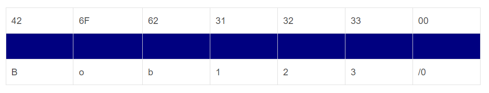
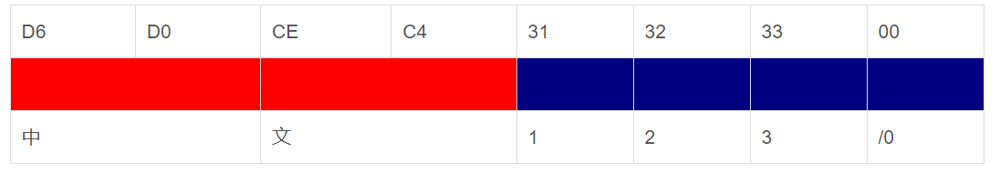
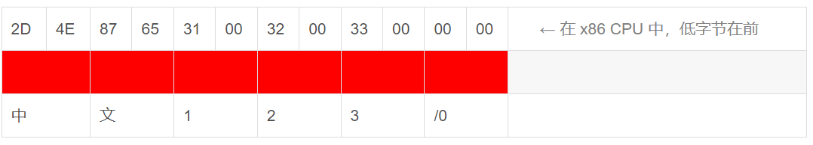

# 1.字符与编码的发展

从计算机对多国语言的支持角度看，大致可以分为三个阶段：

|        | 系统内码                | **说明**                                                     | **系统**                                         |      |
| ------ | ----------------------- | ------------------------------------------------------------ | ------------------------------------------------ | ---- |
| 阶段一 | **ASCII**               | 计算机刚开始只支持英语，其它语言不能够在计算机上存储和显示。 | 英文 DOS                                         |      |
| 阶段二 | **ANSI编码 （本地化）** | 为使计算机支持更多语言，通常使用 0x80~0xFF 范围的 2 个字节来表示 1 个字符。比如：汉字 '中' 在中文操作系统中，使用 [0xD6,0xD0] 这两个字节存储。  不同的国家和地区制定了不同的标准，由此产生了 GB2312, BIG5, JIS 等各自的编码标准。这些使用 2 个字节来代表一个字符的各种汉字延伸编码方式，称为 **ANSI 编码**。在简体中文系统下，ANSI 编码代表 GB2312 编码，在日文操作系统下，ANSI 编码代表 JIS 编码。  不同 ANSI 编码之间互不兼容，当信息在国际间交流时，无法将属于两种语言的文字，存储在同一段 **ANSI 编码**的文本中。 | 中文 DOS，中文 Windows 95/98，日文 Windows 95/98 |      |
| 阶段三 | **UNICODE （国际化）**  | 为了使国际间信息交流更加方便，国际组织制定了 **UNICODE 字符集**，为各种语言中的每一个字符设定了统一并且唯一的数字编号，以满足跨语言、跨平台进行文本转换、处理的要求。 | Windows NT/2000/XP，Linux，Java                  |      |

字符串在内存中的存放方法：

在 ASCII 阶段，**单字节字符串**使用一个字节存放一个字符（SBCS）。比如，"Bob123" 在内存中为：

在使用 ANSI 编码支持多种语言阶段，每个字符使用一个字节或多个字节来表示（MBCS），因此，这种方式存放的字符也被称作**多字节字符**。比如，"中文123" 在中文 Windows 95 内存中为7个字节，每个汉字占2个字节，每个英文和数字字符占1个字节：

在 UNICODE 被采用之后，计算机存放字符串时，改为存放每个字符在 UNICODE 字符集中的序号。目前计算机一般使用 2 个字节（16 位）来存放一个序号（DBCS），因此，这种方式存放的字符也被称作**宽字节字符**。比如，字符串 "中文123" 在 Windows 2000 下，内存中实际存放的是 5 个序号：

# 2.字符，字节，字符串

理解编码的关键，是要把字符的概念和字节的概念理解准确。这两个概念容易混淆，我们在此做一下区分：

|                | 概念描述                                                     | **举例**                      |
| -------------- | ------------------------------------------------------------ | ----------------------------- |
| 字符           | 人们使用的记号，抽象意义上的一个符号。                       | '1', '中', 'a', '$', '￥', …… |
| 字节           | 计算机中存储数据的单元，一个8位的二进制数，是一个很具体的存储空间。 | 0x01, 0x45, 0xFA, ……          |
| ANSI 字符串    | 在内存中，如果“字符”是以 **ANSI 编码**形式存在的，一个字符可能使用一个字节或多个字节来表示，那么我们称这种字符串为 **ANSI 字符串**或者**多字节字符串**。 | "中文123" （占7字节）         |
| UNICODE 字符串 | 在内存中，如果“字符”是以在 UNICODE 中的序号存在的，那么我们称这种字符串为 **UNICODE 字符串**或者**宽字节字符串**。 | L"中文123" （占10字节）       |

由于不同 ANSI 编码所规定的标准是不相同的，因此，对于一个给定的**多字节字符串**，我们必须知道它采用的是哪一种编码规则，才能够知道它包含了哪些“字符”。而对于 **UNICODE 字符串**来说，不管在什么环境下，它所代表的“字符”内容总是不变的。

# 3.字符集与编码

各个国家和地区所制定的不同 ANSI 编码标准中，都只规定了各自语言所需的“字符”。比如：汉字标准（GB2312）中没有规定韩国语字符怎样存储。这些 ANSI 编码标准所规定的内容包含两层含义：

1. 使用哪些字符。也就是说哪些汉字，字母和符号会被收入标准中。所包含“字符”的集合就叫做“**字符集**”。
2. 规定每个“字符”分别用一个字节还是多个字节存储，用哪些字节来存储，这个规定就叫做“**编码**”。

各个国家和地区在制定编码标准的时候，“字符的集合”和“编码”一般都是同时制定的。因此，平常我们所说的“字符集”，比如：GB2312, GBK, JIS 等，除了有“字符的集合”这层含义外，同时也包含了“编码”的含义。

“**UNICODE 字符集**”包含了各种语言中使用到的所有“字符”。用来给 UNICODE 字符集编码的标准有很多种，比如：UTF-8, UTF-7, UTF-16, UnicodeLittle, UnicodeBig 等。

# 4.几种误解，以及乱码产生的原因和解决办法

